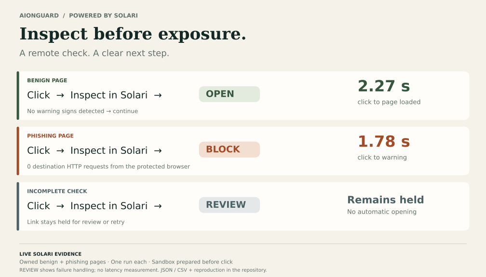
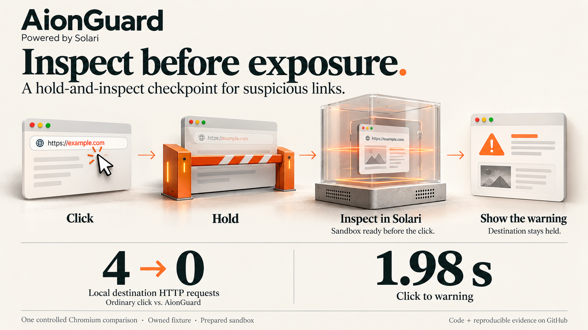
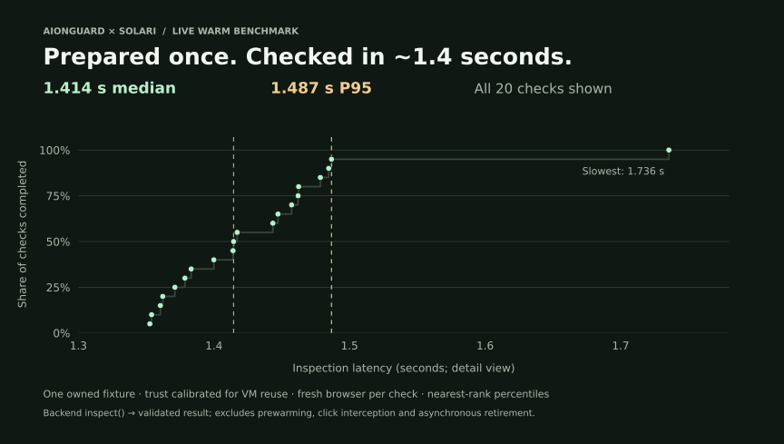
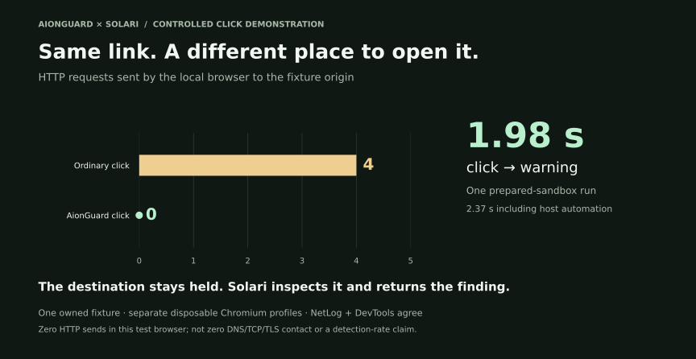

# AionGuard

**Inspect before exposure.**

**A link-checking app Solari could offer its own customers.**

Packaged as **SolariGuard**, AionGuard could turn Solari’s sandbox infrastructure into a customer-facing subscription feature. Customers would download a client, connect their Solari account, and check links remotely before opening them on important devices. Solari could offer it as a paid add-on or include it in a subscription tier.

**Solari provides the infrastructure. SolariGuard would make it useful to customers who don’t want to build an application themselves.**

AionGuard holds a link, opens the destination in a prepared Solari sandbox, and checks the page for warning signs before your browser visits it. When no warning signs are detected, it opens the page. When it finds warning signs, it keeps the link blocked and shows why. If the check cannot complete, it holds the link for review.

**Check remotely. Continue locally. Keep the evidence.**

## See it work



Live controlled Chromium tests show the complete check → open / block / review flow:

| Link | What happens | Measured result |
| --- | --- | --- |
| Owned benign page | Inspect, then open in the protected browser | **2.27 s** click → page loaded |
| Owned phishing page | Inspect, block, and show a warning | **1.78 s** click → warning; **0 destination HTTP requests** from the protected browser |
| Failed or incomplete inspection | Hold for review or retry | No automatic opening |

Measured against owned test pages, with one prepared-sandbox run per page. [Results, evidence, and reproduction](docs/link-release.md).

**Warm Solari inspection: 1.41 s median · 1.49 s P95 · n=20.** Separate backend measurements on one controlled fixture. In that run, VM creation took **0.653 s** and browser preparation took **36.965 s**, before the timed checks. Warm latency excludes preparation; idle cost and per-device economics have not been measured. [Timing boundaries](docs/warm-solari.md#measured-live-qualification--september-29-2026-new-york).

**Reviewer quick path — 30-second review:** [open/block evidence](docs/link-release.md#measured-live-result--september-30-2026) → [warm latency](docs/warm-solari.md) → [original 56-second product demo (Vercel)](#watch-the-original-demo) → [reproduce](docs/link-release.md#reproduce-the-live-browser-pair).

## A subscription feature for Solari

This submission explores what Solari itself could offer as a product: an everyday link-checking service for organizations and individuals, built on the infrastructure it already operates.

The opportunity is to reach customers who need the service without requiring them to become developers. Each enrolled device could bring recurring link inspections and ongoing Solari usage.

The intended experience is simple:

1. **Install the client** on a device used for sensitive work—such as a founder's laptop, an administrator's workstation, or a finance team's computer.
2. **Connect a Solari account** to run inspections away from that device.
3. **Enable link checks.** The client keeps a sandbox prepared, checks destinations before opening them, and shows a screenshot and findings when it catches warning signs.

Solari could package the service in either of two ways:

- **Paid add-on:** customers add SolariGuard to an existing subscription for selected devices.
- **Included tier feature:** a subscription tier includes a defined number of devices and an inspection allowance.

AionGuard supplies the source-available inspection and navigation controller. Solari supplies the remote execution environment. Prepared sandboxes and reuse keep the service ready between clicks.

**SolariGuard is our proposed subscription offering.** The current build includes the local dashboard and Chromium inspection flow; the product roadmap adds client distribution, device enrollment, and Solari account integration. Under the application license, a commercial SolariGuard offering would require a [separate written agreement](COMMERCIAL-LICENSING.md).

## Built for links you would rather check first

The useful moment is an unexpected link in an email, message, or document—especially on a device with access to important accounts and work. AionGuard gives that destination a remote inspection before letting it run in the protected browser.

A screenshot and findings explain each warning. When a completed check returns **“No warning signs detected,”** browsing continues.

## From hackathon to click checkpoint

AionGuard was first built with Vercel Sandbox at the **OpenAI Astra Hackathon in New York**, then migrated to Solari.

The Solari workflow prepares the sandbox before the click, opens a fresh browser for each inspection, and reuses the VM between checks. That moves browser setup out of the click path. The measured warm inspection median is **1.414 seconds**; this is not a like-for-like speed or cost comparison with Vercel.

## Inspection pipeline



1. **Hold navigation.** The controlled Chromium extension intercepts the registered link and keeps the destination out of the protected browser.
2. **Acquire a prepared Solari VM.** The controller sends the destination to an environment that is already ready.
3. **Open a fresh remote browser.** The page loads inside the sandbox and produces rendered-page evidence.
4. **Run deterministic detectors.** Five checks look for credential phishing, external password forms, executable-download lures, tech-support scams, and ClickFix command prompts.
5. **Decide and continue.** Findings block the link. A completed live check with no findings opens the inspected destination. An incomplete or failed check stays held for review. Findings and a screenshot remain in the receipt.
6. **Retire on a finding.** A flagged VM is retired and a replacement is prepared. Checks without findings can reuse the prepared VM.
7. **Escalate optionally to Astra.** [Advisory review](docs/astra-review-benchmark.md) provides a second opinion alongside the findings. The controller retains navigation authority.

## Why Solari?

Solari provides the sandbox lifecycle behind the checkpoint: prepare ahead, inspect in a fresh browser, reuse the VM between checks, and replace it after a finding. Keeping browser setup out of the click path is what makes the measured latency useful.



[Full timings, preparation cost, and lifecycle evidence](docs/warm-solari.md)

Solari is our preferred provider for speed and convenience. Provider adapters keep the inspection layer separate from the execution substrate.

## Supporting evidence: the original click comparison



The graphic shows the earlier **live Solari** [baseline comparison](docs/controlled-click.md): the same phishing link produced **4 destination requests normally, versus 0 with AionGuard**. The newer open/block results above extend that demonstration.

## Engineering evidence

**434 tests passing** cover the detector, controller, navigation handoff, release authority, advisory restrictions, and sandbox lifecycle. [CI workflow](.github/workflows/ci.yml) · [JSON/CSV results](docs/evidence/link-release-2026-09-30) · [Zero remaining AionGuard resources in ten post-run inventories](docs/evidence/link-release-2026-09-30/post-run-inventory.json).

## Build and evaluation

This build runs the open/block/review flow in controlled Chromium against owned pages. These live tests do not establish real-world detection rates, cloaking or sandbox-evasion resistance, or hostile-page containment. The inspector disables page scripts; content can differ in a normal authenticated browser. VMs are reused after successful checks with no findings, and retired on findings, inspection errors, or resource limits.

See the [release behavior and deployment scope](docs/link-release.md), [detector evaluation](docs/benchmark.md), and [click-test methodology](docs/controlled-click.md#scope) for methodology and reproduction.

## Watch the original demo

[▶ Watch the 56-second hackathon demo](https://www.youtube.com/watch?v=UJkPWHyTg-U)

This video shows the original **Vercel Sandbox build from the OpenAI Astra Hackathon in New York**. The current Solari implementation is demonstrated by the live open/block evidence and measurements above.

## Run AionGuard

Use Node 24 LTS:

```sh
git clone https://github.com/EXO-Robotics/AionGuard-Solari.git
cd AionGuard-Solari
npm ci
npm run build
cp .env.example .env
```

For a preview without cloud credentials, set `AIONGUARD_MODE=MOCK` in `.env`, run `npm start`, and open **http://127.0.0.1:4317**. Connect using the private token in `runtime-data/controller-token`.

For live inspections against your own harmless test page, follow the [Solari setup guide](docs/quickstart.md). Credentials stay in the local controller.

[Run the checks](docs/quickstart.md#checks) · [Presentation kit](docs/presentation.md)

[License](LICENSE): **source-available**. Personal and internal-business use is free. Under this license, resale, paid hosting for external customers, and commercial bundling require a separate written agreement. [Commercial licensing](COMMERCIAL-LICENSING.md) · [Contributors](AUTHORS.md) · [Third-party notices](THIRD-PARTY-NOTICES.md).
