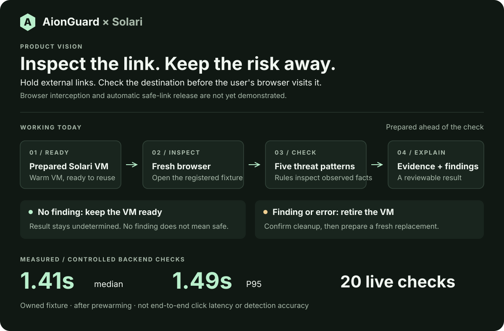

# AionGuard × Solari

**Inspect the link before you trust it.**

AionGuard is building a checkpoint between a link and your browser: open the destination somewhere isolated, inspect it, and show the evidence before you proceed.

The working prototype now intercepts a real link click in a controlled Chromium demo, holds the destination, and inspects our owned page in Solari. Automatic safe-link release is still future work.

### 1.41 s median · 1.49 s P95

**20 live checks in one prepared Solari sandbox.** Measured backend inspection time on a controlled fixture, after browser setup.



[▶ Watch the demo](https://www.youtube.com/watch?v=UJkPWHyTg-U) · [Try it](#try-it) · [Measured results](docs/warm-solari.md) · [Solari fork](https://github.com/EXO-Robotics/solari-cookbook/tree/main/applications/aionguard)

## What happens to a link?

1. **Prepare ahead.** Solari gets a sandbox ready before the first check.
2. **Inspect remotely.** A fresh browser captures the page and five rules look for warning signs.
3. **Show the evidence.** AionGuard returns the findings and a screenshot. A flagged check retires the sandbox and prepares a replacement.

Checks with no findings reuse the prepared VM. **No findings means “undetermined,” not “safe.”** The current prototype does not automatically release navigation.

The five checks cover credential phishing, external password forms, executable-download lures, tech-support scams, and ClickFix prompts that ask you to run a command.


## One real click, before the destination

**Ordinary click: 4 local browser requests. AionGuard click: 0.**

In one controlled comparison, Solari found the warning signs and the protected browser showed the warning in **1.98 seconds**. The destination stayed held. Both Chromium network recordings agreed on the request counts.


One owned fixture, two disposable browser profiles. This proves the tested click path, not protection across the whole web. [Screenshots, raw measurements, and reproduction →](docs/controlled-click.md)

## How fast is it?


| Path | Median | P95 | What was measured |
| --- | ---: | ---: | --- |
| Prepared sandbox inspection | **1.414 s** | **1.487 s** | 20 controlled checks |
| Finding → retirement initiated | **1.552 s*** | — | One separate phishing-finding run |
| Astra advisory review | **7.652 s** | **8.901 s** | 6 calls on authored structural evidence |
| Inspect button → result | **1.765 s*** | — | One live ready-sandbox UI check |
| Intercepted click → warning | **1.981 s*** | — | One controlled Chromium click; 2.370 s including host automation |

\*Single runs, not medians or percentiles. Retirement finished asynchronously. [UI timing and cold fallback →](docs/click-timing.md)

The VM was created in **653 ms**. Browser preparation took **36.965 s**, before the measured checks. Preparing once removes that setup from subsequent checks. The flagged VM was replaced, and the final inventory audit found no remaining AionGuard resources.

These are repeated checks of one owned fixture, with trust deliberately adjusted for the reuse test. They measure speed and lifecycle behavior—not real-world detection accuracy. [CSV, JSON, and test details →](docs/warm-solari.md)

## Watch the original demo

The video was recorded with **Vercel Sandbox at the OpenAI Astra Hackathon in New York**. This submission runs on **Solari**, our preferred provider for speed and convenience. Other VM providers can be supported through adapters.

[▶ Watch the 56-second AionGuard demo](https://www.youtube.com/watch?v=UJkPWHyTg-U)

## Try it

Use Node 24 LTS:

```sh
git clone https://github.com/EXO-Robotics/solari-cookbook.git
cd solari-cookbook/applications/aionguard
npm ci
npm run build
cp .env.example .env
```

Set `AIONGUARD_MODE=MOCK` in `.env` for a preview without cloud credentials. Then run `npm start` and open **http://127.0.0.1:4317**. Connect with the private token in `runtime-data/controller-token`.

For real Solari checks, add your private key and owned demo URL using the [live setup guide](docs/quickstart.md). Credentials stay in the local controller.

## What is ready—and what is next?

**Working:** controlled Chromium click interception, remote page inspection, five warning-sign checks, screenshots, prepared VM reuse, flagged retirement, automatic replacement, and downloadable evidence.

**Still to prove:** general browser deployment, safe-link release, hostile-page containment, and detection accuracy on unseen real-world pages. Use harmless owned fixtures only. The challenge corpus exposed misses and false positives; an earlier cold benchmark also found inconsistent cleanup responses. [Evidence and limitations →](docs/benchmark.md)

The fast path stays deterministic. [Astra’s optional second opinion](docs/astra-review-benchmark.md) is measured separately; it cannot authorize navigation or take actions. The workspace also exports [direct click-to-result timings](docs/click-timing.md).

[Full submission record](docs/solari-submission.md) · [Run the checks](docs/quickstart.md#checks) · [Submission post draft](docs/submission-post.md)

MIT licensed.
