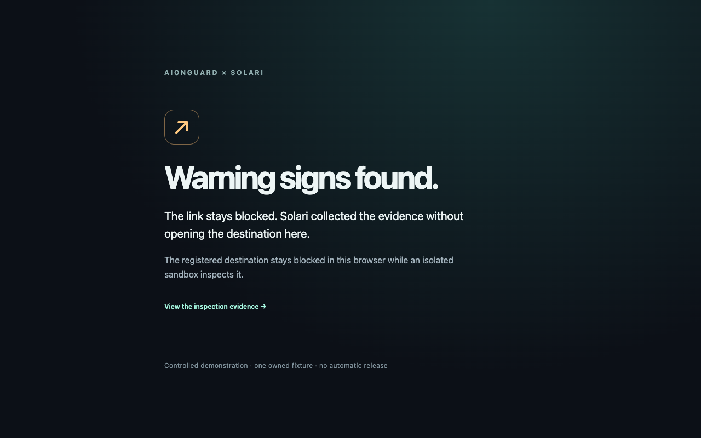

# A real click, held before navigation

This is a controlled Chromium demonstration against our owned AionPhish fixture.
A normal link click is compared with the same click in a fresh profile containing
the AionGuard extension. The protected browser holds the destination while a
prepared Solari sandbox inspects it, then displays the finding.

## Recorded result

**The protected click stayed held, and Solari returned a suspicious finding.**

| Measurement | Ordinary click | AionGuard click |
| --- | ---: | ---: |
| Local browser HTTP requests to the fixture origin | **4** | **0** |
| Main document requests | 1 | 0 |
| DOM click → warning, after two animation frames | — | **1.981 s** |
| Host pointer dispatch → observed warning | — | **2.370 s** |

One baseline and one protected click, Chromium 145.0.7632.6, September 30, 2026.
The 4 baseline requests include the document and three assets. Both NetLog and
DevTools agreed on 4 versus 0. The protected recording continued for two seconds
after the warning. These are request counts, not a phishing-detection rate.

The sandbox was ready before the click and retired on the finding. Cleanup was
pending when the decision appeared, completed during shutdown, and ten subsequent
complete provider inventories contained zero AionGuard resources.



[Measured JSON](evidence/controlled-click-2026-09-30/report.json) ·
[Inspection receipt](evidence/controlled-click-2026-09-30/receipt.json) ·
[Source hashes](evidence/controlled-click-2026-09-30/source-manifest.json) ·
[Cleanup audit](evidence/controlled-click-2026-09-30/post-run-inventory.json)

## What the demonstration measures

The harness installs actual Manifest V3 session rules and verifies their contents
before clicking. It uses ordinary automated pointer input on a normal anchor.
There is no Playwright request routing or substituted response. Two separate
browser profiles capture Chromium NetLog and DevTools network events.

A baseline must send the destination document request. Both logs must also contain
a successful local-page request, so an empty or missing recording cannot pass.
The parser decodes the captured browser's event constants and counts HTTP/1,
HTTP/2 and QUIC header-send events attributed to the destination origin. Unknown
attribution, incomplete JSON, missing constants or inconsistent evidence fails
qualification. HTTP/2 and QUIC are disabled in both arms for this recorded test.

Timing begins with the automated click and ends when the warning is rendered.
The report includes the trusted DOM click to two animation frames after the
warning update, a host-monotonic pointer-dispatch-to-DOM-observation span, and a
host binding-receipt span. These are one-run measurements, not percentiles or
physical input/display measurements. Sandbox preparation happens beforehand.

## Reproduce

Use the live Solari configuration in [the setup guide](quickstart.md), with this
owned fixture and `https://idp.acme.invalid` as the identity-provider origin:

```sh
npm ci
npx playwright install chromium
npm run build
AIONGUARD_FIXTURE_URL=https://mfrey18.github.io/AionPhish/ \
AIONGUARD_IDP_ORIGINS=https://idp.acme.invalid \
npm run qualify:click -- --live --output runtime-data/controlled-click-new
```

This starts a private local controller and disposable Chromium profiles, creates
real Solari resources, prepares a sandbox, runs the two clicks and shuts down.
Use a new output directory for each attempt. Never publish raw browser profiles,
NetLogs or controller logs: they can contain private authorization headers.
Publish only reviewed summaries, source hashes and screenshots.

## Scope

The extension is an opt-in demonstration for one registered fixture, not an
installer for everyday browsing. A short-lived operator authorization admits one
inspection; a separate entry token cannot read general cases or screenshots.
Errors, expired authorization, findings and no findings all keep navigation held.
Closing the disposable profile ends its local blocking rules. The existing
Safari recovery mechanism is unchanged.

A zero HTTP-send result applies to this test browser and observation window. It
does not prove zero DNS/TCP/TLS contact, protection of the whole computer, hostile
page containment, detection accuracy or automatic safe-link release. The baseline
uses an inert owned page; no real credentials are entered. `CHROME_HANDOFF` in a
receipt is provenance reported by the endpoint; the independent browser recording
is what supports the click-interception result.

## Initial failure retained

The first live attempt did not reach inspection. Chrome rejected the holding-page
redirect because its source origin was not declared. Local real-browser tests
also exposed missing tab URL permission and the absent Origin header on status
GET requests. The corrected extension checks its exact live document and polls
status with POST. The [failed-attempt record](evidence/controlled-click-2026-09-30/initial-failure.json)
retains its source/log hashes and ten clean post-run inventories. It is not
counted as a completed inspection.

## Review

A read-only Grok review received a sanitized design description without source or
credentials. Accepted: verify installed rules before clicking; corroborate request
counts; keep baseline and recording canaries; fence single-use admission before
async work; preserve blocking on expiry and failure; report narrow timing and
network boundaries. Rejected: a remote Solari fetch invalidates the local-browser
comparison—the remote fetch is the intended intervention. An unguessable holding
page alone would not prove a click, so the harness records the actual click instead.
Host-wide containment and packet-level verification remain unverified.

References: [Chrome request-rule lifecycle](https://developer.chrome.com/docs/extensions/reference/api/declarativeNetRequest),
[Chromium NetLog event definitions](https://raw.githubusercontent.com/chromium/chromium/main/net/log/net_log_event_type_list.h),
[NetLog diagnostic scope](https://www.chromium.org/developers/design-documents/network-stack/netlog/).
