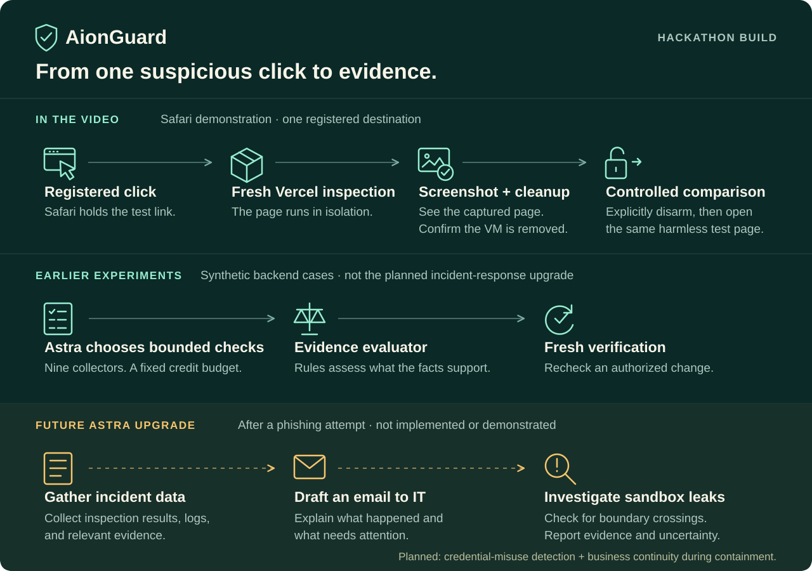

> Historical Vercel submission, September 10. For the current bare-bones Solari candidate, see [Solari submission](solari-submission.md). The local VM and planned Astra features below are not part of the current detector deliverable.

# AionGuard — hackathon submission overview

**AI investigates. Evidence decides.**

[▶ Watch the 56-second submission video](https://www.youtube.com/watch?v=UJkPWHyTg-U)

AionGuard demonstrates registered-link inspection through Safari and Vercel on one Mac with one controlled destination. A future Astra upgrade would respond after a phishing attempt by gathering incident data, drafting an IT notification, and investigating possible sandbox leaks. Earlier synthetic backend experiments are documented separately.

## What the demonstration shows

1. The operator arms a short protection lease for the registered AionPhish project path.
2. A normal click from the controlled email reaches Safari's extension handoff and a fresh Vercel inspection.
3. The inspector returns a captured page image and a suspicious classification. Sandbox stop and deletion are confirmed.
4. Explicit disarm removes the scoped Safari rules with a matching acknowledgment. The unprotected comparison opens the harmless fixture and enters made-up details to trigger confetti.

The video shows a captured Vercel screenshot, not a live remote browser stream. Its status overlay is the optional [recording companion](../scripts/demo-viewer.swift), which reads real controller state. It neither arms protection nor processes the keyboard shortcut. The confetti is controlled fixture behavior, not evidence of compromise or credential theft.

## The intended next act: Astra and continuity

The planned **Astra incident-response upgrade** would spawn after a phishing attempt is detected. It would gather available incident evidence, formulate an email notifying the IT team, and investigate possible data or activity leaks across the sandbox boundary. Findings would need to distinguish observed evidence from unresolved questions.

This automatic post-phishing workflow, IT-email preparation, and sandbox-leak investigation are not implemented or demonstrated. The earlier Astra adapter completed two synthetic backend experiments involving bounded checks and fresh verification; those results do not establish the future upgrade. Its restricted experimental inputs excluded the inspected webpage and screenshot.

**Tripwire** is planned to investigate whether credentials captured during a phishing attempt were later used in a likely harmful way. It would correlate the incident with available sign-in and access activity, surface suspected misuse, and retain the evidence and uncertainty behind that assessment. The archived plan's expiring decoys and controlled replay are a proposed lab validation method for this broader goal.

**Continuity** addresses a phished device that also hosts a system needed by the business. Isolating that device can interrupt essential operations and create a difficult recovery task for IT. The planned capability would use Astra to identify and recover the necessary services, dependencies, and state into a secured microVM. The recovered systems could then support essential business work while the original device remained contained and IT investigated and repaired it.

The recovered system, its inputs, isolation, permissions, and output would need validation before work resumed; copying a compromised runtime alone would not establish safe recovery. Neither credential-misuse investigation nor this continuity workflow is implemented or demonstrated here. The original lab plan begins with one approved workload and staged acceptance gates; the wider product goal is business continuity during containment. See the [current product direction](build-decisions.md#tripwire-and-continuity-product-direction) and [historical roadmap](planning/plan.md).



## What was tested separately

- Two complete authenticated HTTP cases exercised real Vercel inspection, real Astra decisions, bounded collectors, a synthetic defensive change, and fresh after-state verification.
- Installed Safari lease expiry and physical `0000` input in TextEdit removed armed rules and produced matching native acknowledgments.
- Final submission checks passed 263 tests across 14 files, TypeScript, build, formatting, and six deterministic comparison runs. The Swift recording companion compiled successfully. Repository CI reports the checks for the exact submitted commit.

See the [integration verification record](integration-verification.md) for case identities, timestamps, retained failures, and the distinction between backend and recorded Safari evidence. Private operational receipts and raw recordings remain excluded from the repository.

## Architecture and scope

| Component | Responsibility |
| --- | --- |
| Safari extension and native helper | Scoped registered-link rules, bounded leases, and recovery acknowledgment |
| Local authenticated controller | Case state, authorization, execution limits, and evidence receipts |
| Vercel Sandbox inspector | Fresh isolated browser observation, screenshot, deterministic classification, and cleanup |
| Earlier Astra adapter experiment | Choose among nine bounded collectors under an atomic four-credit budget; separate from the future incident-response upgrade |
| Evidence evaluator | Separate observations from model rationale and require fresh evidence for a verified after-state |

The current provider is Vercel Sandbox. The separate [Apple Silicon VM prototype](https://github.com/EXO-Robotics/AionGuard-Local-VM) is published in its own repository and is not integrated into this submission. Organization data and defensive changes are synthetic. There is no multi-tenant deployment, whole-Mac lockdown, or general-purpose URL protection claim.

## Provider history and local VM

The team originally intended to use Solari, but reported it unavailable during the hackathon build. The finished demonstration therefore uses Vercel Sandbox. This is a development-history note, not an independently verified current or service-wide outage report.

We also developed [our own local Apple Silicon VM](https://github.com/EXO-Robotics/AionGuard-Local-VM) in a separately licensed project. Both VM implementations, tests, and setup instructions are published there; provisioned guest disks and private runtime evidence are excluded. The separate-project review supplied by the team reports real browser rendering, screenshots, fresh instances, cleanup, and timeout recovery. Those results support further local-provider integration work; they do not establish the recorded AionPhish → Safari handoff → inspection → screenshot/classification → cleanup path on the local VM.

At that review, three compatibility gaps prevented a direct replacement:

- The local registered destination was still `example.com`, not AionPhish.
- The local worker and validator supported `ACME` or `UNKNOWN`, while the finished application recognizes `AIONPHISH`.
- LIVE application execution selected Vercel, and result contracts required `VERCEL_SANDBOX`; there was no local application adapter.

The local broker also fetched the document on the Mac before guest rendering, external resources were unavailable, and reported execution was roughly 35 seconds plus disk verification. The Mac-side fetch means this prototype does not establish the same intended local-fetch boundary as remote inspection.

**Vercel remains the provider for this submission.** A local replacement needs targeted destination, classification, provider-contract, and fetch-boundary work followed by a successful repeat of the finished Safari flow. These local VM observations come from the supplied separate-project review; the VM was not requalified or integrated during this documentation update. Its source is available in [AionGuard-Local-VM](https://github.com/EXO-Robotics/AionGuard-Local-VM).

## Reproduce the software workspace

Use Node 24 LTS and the repository's pinned dependencies:

```sh
git clone https://github.com/EXO-Robotics/AionGuard.git
cd AionGuard
npm ci
npm run check
AIONGUARD_MODE=MOCK npm start
```

Open `http://127.0.0.1:4317` and connect using the local controller token described in [setup](setup.md). MOCK mode runs without Vercel or Astra credentials; it does not reproduce the live-provider evidence.

A live Safari installation requires macOS, Safari, Xcode/signing setup, manual extension activation and website permissions, token pairing, healthy native recovery, and valid Vercel/Astra configuration. Follow the [Safari guide](../src/extension/README.md), [recovery guide](../src/extension/recovery/README.md), and [inspector guide](../src/server/isolation/README.md). Provider credentials and snapshots expire; the recorded session does not guarantee they remain available.

The optional recording companion can be compiled without launching it:

```sh
mkdir -p runtime-data/recording-viewer
swiftc scripts/demo-viewer.swift -o runtime-data/recording-viewer/aionguard-demo-viewer -framework AppKit
```

When deliberately recording an existing authorized case, run that binary with `--token-file /absolute/path/to/runtime-data/controller-token --run-id run_ID --port 4317`. It performs read-only loopback requests and exits after ten minutes. The token file must remain private. It is not required for the core application.

## Known limits

The recorded Safari retry is bounded workflow evidence. Independent attribution proving suppression of all local destination requests, modified clicks, redirects, profile variants, suspension, restart, and helper/controller failure coverage are unfinished. The receipt retains `endpointInterceptionVerified: false` and `productionScaleVerified: false`.

Some attempts disarmed early after recovery readiness was lost, and a first click sometimes opened a blank tab before a retry reached inspection. Synthetic zero-key input failed in the recorded retry; explicit disarm succeeded. Physical `0000` passed separately in ordinary TextEdit input. Secure Input and suspended/frozen components prevent an unconditional keyboard recovery guarantee. Disable the extension or fully quit Safari if rule removal fails.

Scaling requires durable storage, queued execution, tenant isolation, distributed budgets, and measured reliability. These are future work; Tripwire and continuity are also deferred.

## Submission assets and license

The application is source-available under the [Personal and Internal Business Use License](../LICENSE). The [submission video is available on YouTube](https://www.youtube.com/watch?v=UJkPWHyTg-U). It shows the scoped Safari inspection and controlled comparison described above. Linking the video and merging the code do not establish organizer submission or acceptance.
